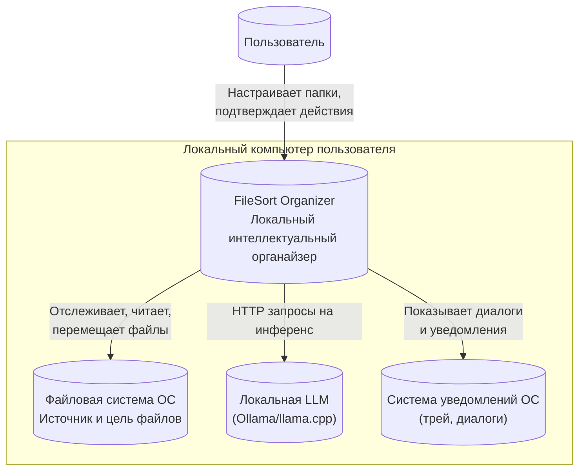
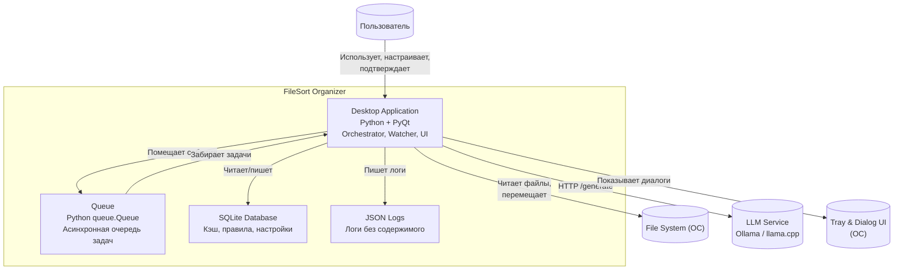
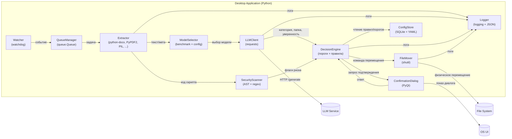

Все диаграммы переписаны в формат **Mermaid** (совместим с GitHub Markdown, Obsidian, MkDocs и др.). Для C4 Context я использовал `flowchart` с нотацией границ (subgraph), что визуально аналогично C4.

---

## 1. C4 Context Diagram 



---

## 2. C4 Container Diagram 



---

## 3. C4 Component Diagram (ядро Desktop App)



---

---

## 4. Workflow Diagram

```mermaid
flowchart TD
    Start([Файл создан]) --> Queue[Поставить задачу в очередь]
    Queue --> Extract[Извлечь текст, метаданные, хеш, код]

    %% Логика кэширования
    Extract --> CacheHit{Cache hit?}
    CacheHit -->|да| ApplyRules[Применить пользовательские правила]
    CacheHit -->|нет| CheckExtract{Извлечение успешно?}

    CheckExtract -->|да| IsScript{Файл скрипт?}
    CheckExtract -->|нет| UseFallback[Использовать имя расширение низкая уверенность]

    IsScript -->|да| SecurityScan["Статический анализ AST regex, фиксация рисков"]
    IsScript -->|нет| CallLLM

    UseFallback --> CallLLM

    SecurityScan --> CallLLM["Вызвать LLM если доступна и железо подходит"]

    CallLLM --> LLMCheck{LLM ответила корректно?}
    LLMCheck -->|да| GetResult[Получить категорию папку уверенность]
    LLMCheck -->|нет| FallbackRules["Fallback на облегченный режим, категория по расширению имени"]

    GetResult --> ApplyRules
    FallbackRules --> ApplyRules

    ApplyRules --> NeedConfirm{"Скрипт и (риск или подтверждение скриптов)?"}
    NeedConfirm -->|да| ShowDialog["Показать диалог подтверждения с деталями риска"]
    NeedConfirm -->|нет| CheckAuto{"Уверенность выше порога и авто-перемещение?"}

    ShowDialog --> UserConfirm{Пользователь разрешил?}
    UserConfirm -->|да| MoveFile[Переместить файл]
    UserConfirm -->|нет| Skip[Пропустить файл, лог отказ]

    CheckAuto -->|да| MoveFile
    CheckAuto -->|нет| OptionalDialog[Показать диалог подтверждения опционально]
    OptionalDialog --> UserConfirm2{Разрешил?}
    UserConfirm2 -->|да| MoveFile
    UserConfirm2 -->|нет| Skip

    MoveFile --> MoveSuccess{Перемещение успешно?}
    MoveSuccess -->|да| LogSuccess[Записать успех обновить кэш]
    MoveSuccess -->|нет| IsTemporary{"Ошибка временная? Permission busy"}
    IsTemporary -->|да| Retry[Повторить до 3 раз]
    Retry --> RetrySuccess{Успех?}
    RetrySuccess -->|да| LogSuccess
    RetrySuccess -->|нет| LogError[Записать ошибку файл остаётся]
    IsTemporary -->|нет| LogError

    LogSuccess --> End([Конец])
    Skip --> End
    LogError --> End
```



---

## 5. Data Flow Diagram

```mermaid
flowchart LR
    SourceFS[("Файловая система исходные файлы")]
    Logs[("Логи JSONL")]
    SQLite[("SQLite кэш правила")]
    TargetFS[("Целевая файловая система организованные файлы")]

    Watcher(("Watcher"))
    Extractor(("Extractor"))
    Security(("Security Scanner"))
    LLM(("LLM Client"))
    Decision(("Decision Engine"))
    Mover(("File Mover"))

    SourceFS -->|событие путь время| Watcher
    Watcher -->|путь к файлу| Extractor
    Extractor -->|чтение содержимого| SourceFS
    Extractor -->|код скрипта| Security
    Security -->|флаги риска описание| Decision
    Extractor -->|текст метаданные до 4k токенов| LLM
    LLM -->|категория папка уверенность| Decision
    
    %% Обновленные связи с SQLite
    SQLite -->|пользовательские правила пороги| Decision
    SQLite -->|хеш → категория (exact match)| Decision
    
    Decision -->|команда src dst need_confirm| Mover
    Mover -->|перемещение файла| TargetFS
    Decision -->|решение уверенность| Logs
    Mover -->|результат перемещения| Logs
    LLM -->|латентность токены| Logs
    Extractor -->|тип файла размер| Logs
    Decision -->|кэш хеш категория| SQLite
```

---

