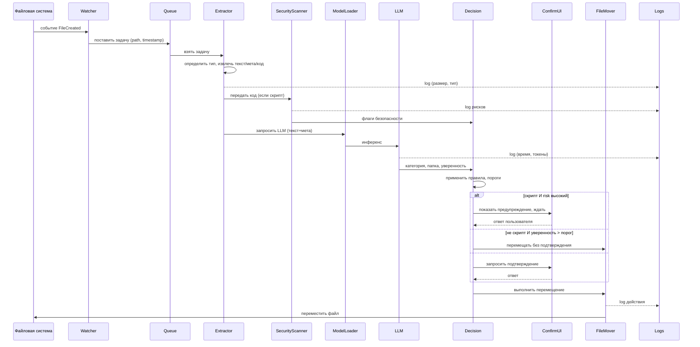

## Архитектура PoC: FileSort Organizer (LIFA)

Ниже представлена фиксация архитектуры перед разработкой. Документ разбит на три части: **system-design.md**, описание **диаграмм** и **спецификации модулей**. Все решения приняты с учётом двух треков: агентского (качество, LLM, защита) и инфраструктурного (стабильность, мониторинг, отказоустойчивость).

---

## 1. system-design.md (краткий, полный архитектурный документ)

### 1.1 Ключевые архитектурные решения

| Решение | Обоснование |
|---------|--------------|
| **Асинхронная очередь задач** (Producer‑Consumer) | Новые файлы от Watcher попадают в очередь; обработка не блокирует мониторинг. Позволяет управлять нагрузкой и retry. |
| **Локальная LLM выбирается по бенчмарку** | Не фиксируем конкретную модель; при старте тестируются доступные (Llama 3.2, Phi‑3, Gemma 2) – выбирается лучшая по latency/accuracy. |
| **Облегчённый режим (без LLM)** как fallback | При нехватке ресурсов или недоступности модели система переключается на правила (расширения, имена, regex). |
| **Статический анализ скриптов до LLM** | Сначала извлекаем код, прогоняем через AST/regex для выявления рисков – это «второе мнение», влияет на решение о подтверждении. |
| **Подтверждение для скриптов всегда** | Даже если LLM сказала «безопасно», система требует явного согласия пользователя на перемещение (принцип безопасности). |
| **Dry‑run режим по умолчанию для новых папок** | При первом мониторинге папки система показывает, что сделает, без фактического перемещения – пользователь утверждает. |
| **Логирование без содержимого** | Логи содержат только метаданные (путь, размер, хеш, категория, уверенность). Извлечённый текст не сохраняется. |
| **Health‑check LLM перед каждым файлом (или раз в N секунд)** | Если модель не отвечает, автоматический fallback на облегчённый режим с уведомлением пользователя. |

### 1.2 Список модулей и их роли

| Модуль | Роль |
|--------|------|
| **Watcher** | Отслеживает файловую систему (FileSystemWatcher / watchdog), ставит события в очередь. |
| **Queue Manager** | Асинхронная очередь (RabbitMQ / Redis / просто `queue.Queue`). Управляет приоритетами, retry, dead‑letter. |
| **Extractor** | Извлекает текст, метаданные, код в зависимости от типа файла. Возвращает структурированный объект. |
| **Security Scanner** | Статический анализ скриптов (AST для Python, regex для других). Возвращает флаги риска и описание. |
| **Model Selector & Loader** | При старте бенчмаркинг, загрузка выбранной LLM (Ollama/llama.cpp). Поддерживает горячую смену модели. |
| **LLM Classifier** | Вызывает LLM с промптом (текст + метаданные), получает JSON: категория, имя папки, уверенность, комментарий. |
| **Decision Engine** | Объединяет результат LLM, Security Scanner и пользовательские правила. Принимает решение: переместить (с подтверждением/без), отложить, пропустить. |
| **User Confirmation Manager** | Отображает диалоги (для скриптов, для неоднозначных случаев). Ждёт ответа, применяет таймаут. |
| **File Mover** | Выполняет физическое перемещение/копирование (через временную копию, проверку прав). Ведёт лог действий. |
| **Config & Rules Store** | Хранит настройки (папки мониторинга, целевая база, пользовательские правила, пороги). SQLite. |
| **Observability** | Логи (JSONL), метрики (Prometheus), трейсы (опционально). Отправка алертов при сбоях. |

### 1.3 Основной workflow выполнения задачи



### 1.4 State / Memory / Context handling

- **State задачи**: `pending` → `extracting` → `classifying` → `decision` → `waiting_confirmation` → `moving` → `done/failed`. Хранится в памяти очереди и в логах.
- **Session state** (не требуется для PoC, но для будущего): нет длительных сессий. Каждый файл обрабатывается независимо.
- **Memory для LLM**: никакой persistent памяти между вызовами. Каждый промпт содержит только содержимое текущего файла + системные инструкции.
- **Context budget**: ограничение на длину извлечённого текста – обрезаем до 4000 токенов (модели 3B). Для больших файлов – только первые N страниц/строк.

### 1.5 Retrieval-контур (не применим в чистом виде, но есть кэширование)

- **Кэш результатов классификации** по хешу файла (SHA-256) – если файл с таким же хешем уже обрабатывался, используем сохранённую категорию (ускоряет повторные запуски). Хранится в SQLite, TTL = 30 дней.

### 1.6 Tool/API-интеграции

| Tool | Тип | Контракт |
|------|-----|----------|
| **FileSystemWatcher** | Встроенный в ОС | События `Created`, `Changed` (фильтр по расширениям) |
| **Ollama / llama.cpp** | Локальный HTTP API | `POST /generate` с параметрами: prompt, temperature, max_tokens. Таймаут 30с. |
| **SQLite** | Локальная БД | Хранение настроек, кэша, логов (опционально). |
| **PyQt/Tkinter** | GUI | Диалоги подтверждения, окно настроек, трей-иконка. |

### 1.7 Основные failure modes, fallback и guardrails

| Failure | Fallback | Guardrail |
|---------|----------|------------|
| LLM недоступна (ollama не отвечает) | Переключиться в облегчённый режим (правила), уведомить пользователя | Health-check каждые 5 секунд; автоматический retry 3 раза с экспоненциальной задержкой |
| LLM выдаёт некорректный JSON | Повторить запрос с temperature=0.2 (не более 2 раз); если не удалось – использовать категорию "other" | Валидация схемы JSON; при ошибке – fallback на правила |
| Извлечение текста не удалось (бинарный файл) | Использовать только имя и расширение для классификации | Логирование ошибки, файл идёт в "others" с низкой уверенностью |
| Недостаточно прав для перемещения | Логировать ошибку, оставить файл на месте, показать уведомление | Попытка скопировать (если нет прав на перемещение), иначе – пропустить |
| Очередь переполнена (>1000 задач) | Старые задачи отклонять, логировать предупреждение | Мониторинг длины очереди; динамическое увеличение воркеров |
| Конфликт имён при перемещении | Автоматически добавить суффикс `_1`, `_2` | Проверка существования перед перемещением |

### 1.8 Технические и операционные ограничения (latency, cost, reliability)

| Параметр | Значение | Примечание |
|----------|----------|-------------|
| **Max latency на файл** (текстовый <1 МБ) | <5 сек (min config), <3 сек (rec.) | Замеряется p95 |
| **Max latency на файл** (скрипт с анализом) | <7 сек | Из-за дополнительного AST |
| **Cost** | 0 (всё локально) | Бесплатно для пользователя, кроме электричества |
| **Reliability (uptime)** | >99% при работающем ПК | Сбои только из-за ОС или фатальных ошибок |
| **RAM usage** | <4 ГБ (LLM) + <200 МБ (приложение) | При использовании квантованной модели (Q4) |
| **Disk usage** | ~4 ГБ (модель) + 1 ГБ (логи/кэш) | Логи ротируются каждые 30 дней |
| **Макс. размер файла** | 1 ГБ (пропускается с предупреждением) | Out of scope для MVP |
| **Макс. длина текста** | 4000 токенов | Обрезаем до этого лимита |

---

## 2. Диаграммы (описание содержания)

Диаграммы должны быть созданы в отдельной папке `docs/diagrams/`. Ниже – спецификация каждой диаграммы.

### 2.1 C4 Context
**Название:** `context.puml`  
**Элементы:**
- **Пользователь** (человек)
- **FileSort Organizer** (наша система)
- **Файловая система** (внешняя система – источник файлов и место назначения)
- **Локальная LLM (Ollama/llama.cpp)** (внешний процесс)
- **Система уведомлений ОС** (для трей-иконки)

**Границы:** вся система работает на одном ПК, внешние зависимости – только OS API и LLM-сервер.

### 2.2 C4 Container
**Название:** `container.puml`  
**Контейнеры:**
- **Desktop App** (Python + PyQt) – содержит UI, orchestrator, watcher
- **Queue** (в памяти Python `queue.Queue`)
- **LLM Service** (отдельный процесс Ollama/llama.cpp) – вызывает через HTTP
- **SQLite DB** – файл на диске
- **File System** – операционная система

### 2.3 C4 Component (ядро)
**Название:** `component.puml`  
**Внутренние компоненты Desktop App:**
- `Watcher`
- `QueueManager`
- `Extractor`
- `SecurityScanner`
- `ModelSelector`
- `LLMClient`
- `DecisionEngine`
- `ConfirmationDialog`
- `FileMover`
- `ConfigStore`
- `Logger`

### 2.4 Workflow / graph diagram
**Название:** `workflow.puml`  
**Состояния и переходы** (на основе sequence diagram выше), включая ветки ошибок:
- `FileCreated` → `Extract`
- `Extract fail` → `Fallback to filename rules` → `Decision`
- `LLM timeout` → `Fallback rules` → `Decision`
- `Decision = move_with_confirmation` → `Show dialog` → (user yes → `Move`, user no → `Skip`)
- `Move fail` → `Log error`, `Retry? (3 times)` → `Skip`

### 2.5 Data flow diagram
**Название:** `dataflow.puml`  
**Потоки данных:**
- **Событие файла** (путь, время) → очередь
- **Извлечённый текст** → не сохраняется, идёт напрямую в LLM и SecurityScanner
- **Метаданные** (размер, хеш, категория, уверенность) → SQLite (кэш) и логи
- **Решение** (целевая папка, need_confirm) → FileMover
- **Логи** → JSON-файлы (без содержимого)
- **Пользовательские правила** → из SQLite в DecisionEngine

---

## 3. Спецификации модулей (docs/specs/)

### 3.1 Cache (кеш классификации)

**Назначение**: избежать повторного вызова LLM для файлов, которые уже были обработаны и с тех пор не изменились.

**Как работает**:
- При первом успешном анализе файла вычисляется SHA-256 от **первых 1 МБ** содержимого (для больших файлов — чтобы не грузить диск).
- В SQLite таблицу `cache` записывается: `hash`, `category`, `target_folder`, `confidence`, `timestamp`.
- При повторной встрече того же файла (например, пользователь переместил его обратно в Downloads) — берём результат из кэша, LLM не вызывается.

**Важное ограничение**:
- Кэш не используется для **скриптов с высоким уровнем риска** (даже если хеш совпадает, выполняется свежий статический анализ — потому что контекст безопасности может измениться).
- Кэш не синхронизируется между устройствами и не предназначен для поиска «похожих» файлов.

**Почему это не «retriever»**:
- Нет векторных эмбеддингов, нет поиска по смыслу.
- Только точное совпадение содержимого (хеш).

### 3.2 Tools / APIs

#### 3.2.1 Ollama Client
- **Контракт:** `POST /api/generate` с JSON:
```json
{
  "model": "llama3.2:3b",
  "prompt": "...",
  "stream": false,
  "temperature": 0.2,
  "max_tokens": 150
}
```
- **Ответ:** `{"response": "..."}`
- **Таймаут:** 30 секунд
- **Ошибки:** ConnectionError, Timeout, HTTP 5xx – fallback на правила.
- **Side effects:** нет.
- **Защита:** ограничение на длину промпта, валидация JSON ответа.

#### 3.2.2 File System API
- **Контракт:** `shutil.move(src, dst)`, `os.makedirs(dst_dir, exist_ok=True)`
- **Ошибки:** PermissionError, FileNotFoundError, OSError – логировать, не перемещать.
- **Таймаут:** не применим (синхронный вызов, но в отдельном потоке).
- **Side effects:** физическое перемещение файла.
- **Защита:** сначала копирование во временную папку, затем удаление исходника (атомарность).

### 3.3 Memory / Context

- **Session state:** не хранится между файлами.
- **Memory policy:** нет persistent memory для LLM.
- **Context budget:** обрезаем текст до 4000 токенов (используя `tiktoken` для оценки). Для файлов больше – берём первые 2000 символов.

### 3.4 Agent / Orchestrator

- **Шаги выполнения (конечный автомат):**
  1. `extract` → если fail → `fallback_extract` (только имя)
  2. `security_scan` (только для скриптов)
  3. `classify` (LLM или правила) → если LLM fail → `rules`
  4. `decide` (порог уверенности, пользовательские правила)
  5. `confirm` (если need_confirm)
  6. `move`
- **Правила переходов:** см. workflow diagram.
- **Stop condition:** файл перемещён или пропущен (или ошибка, которая не может быть исправлена).
- **Retry:** при сбое LLM – 3 попытки с задержкой 1, 2, 4 секунды. При сбое перемещения – 3 попытки с задержкой 1 сек.
- **Fallback:** при любом фатальном сбое – файл остаётся на месте, запись в лог ошибки.

### 3.5 Serving / Config

- **Запуск:** `python main.py` – загружает конфиг, запускает Watcher и Queue, инициализирует модель (или проверяет доступность).
- **Конфигурация:** файл `config.yaml` (или SQLite):
```yaml
watched_folders:
  - "C:\\Users\\%USERNAME%\\Downloads"
  - "C:\\Users\\%USERNAME%\\Desktop"
target_base: "C:\\Users\\%USERNAME%\\Organized"
model: "auto"  # или конкретная "llama3.2:3b", "phi3:mini"
fallback_mode: "rules"  # "llm" или "rules"
dry_run: false
confidence_threshold: 0.7
confirm_scripts: true
```
- **Секреты:** нет (всё локально).
- **Версии моделей:** автоматически определяется при бенчмаркинге. Можно задать вручную.

### 3.6 Observability / Evals

- **Метрики** (выставляются через prometheus_client или логи):
  - `files_processed_total` (по типу файла)
  - `files_moved_total`
  - `files_failed_total` (с причиной)
  - `llm_inference_duration_seconds` (гистограмма)
  - `queue_length`
  - `fallback_triggered_total` (причины)
- **Логи:** JSON-строки в `logs/` с ротацией (10 файлов по 10 МБ). Уровни: DEBUG, INFO, WARNING, ERROR.
- **Трейсы** (опционально для PoC): можно добавить correlation ID для каждого файла через `logging.LoggerAdapter`.
- **Evals (проверки качества):**
  - Автоматический прогон тестового набора из 50 файлов при установке (оценка accuracy).
  - Периодический сбор обратной связи от пользователя (кнопка «Неправильно» в уведомлении).

---


